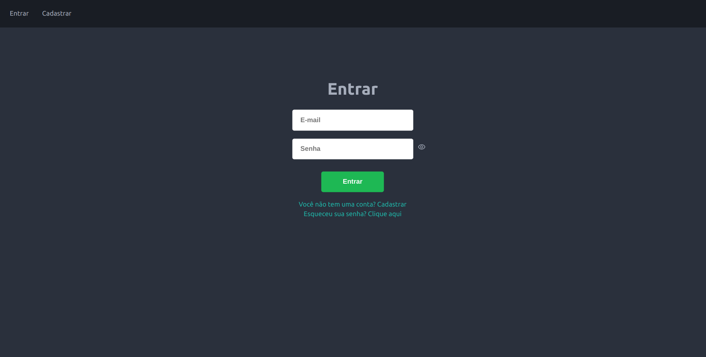
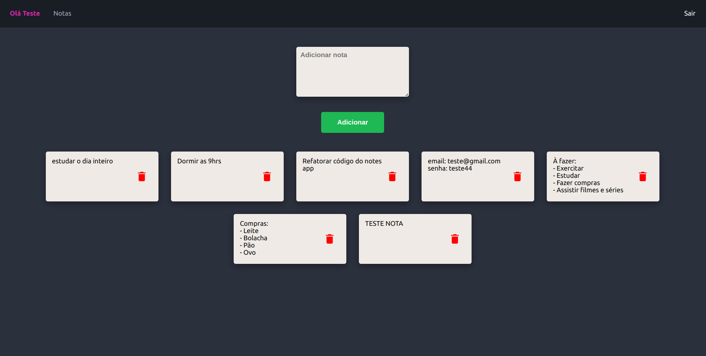

## Sistema de notas :notebook_with_decorative_cover:

:warning: A lentidão no app se deve ao fato de estar hospedada em máquinas de plataformas cloud com planos gratuítos.

### Previews

	<h3>Login</h3>
	

	<h3>Notas</h3>
	

### 1. TEMA:
Aplicação para guardar anotações

### 2. MOTIVAÇÃO:
A falta de um local para anotações de forma segura e rápida

### 3. VISÃO DE NEGÓCIO:
Local de fácil acesso para guardar anotações com rapidez  e segurança

### 4. AMBIENTE DE DESENVOLVIMENTO:
* [VS Code](https://code.visualstudio.com/)

### 5. FERRAMENTAS PARA O DESENVOLVIMENTO:
* [Git](https://git-scm.com/)
* [GitHub](https://github.com/)
* [PostgreSQL](https://www.postgresql.org/)
* [PgAdmin4](https://www.pgadmin.org/)

### 6. INTEGRANTES
Eu (Prince Neres)

### 7. SOLUÇÃO PARA PROBLEMAS IDENTIFICADOS:
* 1° Semana - Banco de dados, A construção do banco foi feita por meio do ORM do Flask SQLAlchemy.
* 2° Semana - Desenvolvimento da API, a API foi desenvolvida com o framework do Python, Flask.
* 3° Semana - Desenvolvimento do Frontend, o front da aplicação foi desenvolvido com a biblioteca do javascript React.Js.
* 4° Semana - Melhorias e Ajustes, Foram de possíveis melhorias na aplicação com refatoração e formatação de código. 

### 8. LINGUAGENS DE PROGRAMAÇÃO 
* [JavaScript](https://www.javascript.com/)
* [Python](https://www.python.org/)

### 9. TECNOLOGIAS:
#### Frontend
* [React.Js](https://pt-br.reactjs.org/)
* [Redux](https://redux.js.org/)
* [Axios](https://axios-http.com/ptbr/docs/intro)
* [React Router DOM](https://v5.reactrouter.com/)

#### Backend
* [Flask](https://flask.palletsprojects.com/en/2.1.x/)
* [Flask Cors](https://flask-cors.readthedocs.io/en/latest/)
* [Flask JWT](https://flask-jwt-extended.readthedocs.io/en/stable/)
* [Flask SQL Alchemy](https://flask-sqlalchemy.palletsprojects.com/en/2.x/)

### Como rodar a aplicação:

### Frontend
1. `npm i` ou `yarn` 
2. `npm start` ou `yarn start`
